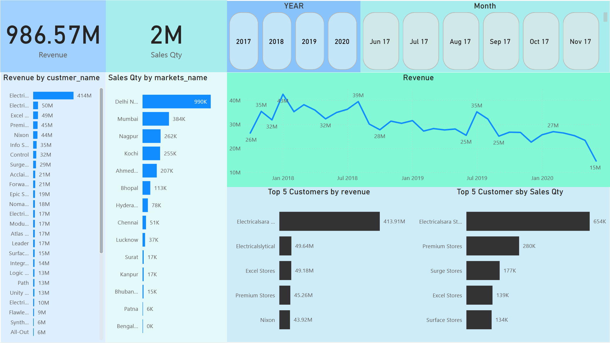

# Sales-Insights
- Performed data cleaning for a dataset of 20k rows in MySQL, rectifying issues such as negative sales figures and currency disparities. Employed Power BI to import, refine, and analyze the dataset, crafting tailored measures.
- Developed a sales dashboard leveraging the cleaned dataset, facilitating strategic decision-making that can increase sales by 10%. It provides detailed insights into sales trends, customer behavior, and product performance.
